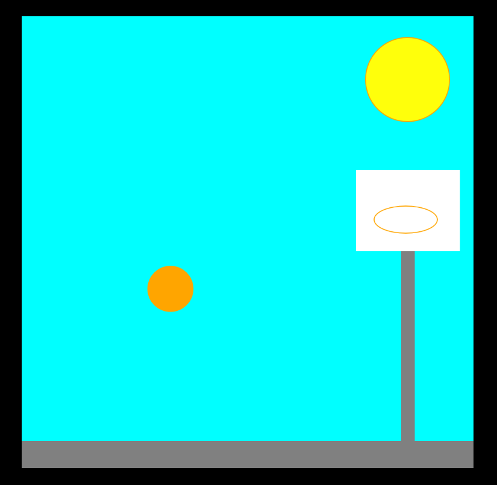

# Bouncing Basketball — p5.js

A p5.js physics simulation of a bouncing basketball, built for my first-term evaluation in **Digital Media II (2024)**. The sketch was part of an "animate a song" assignment — the basketball court theme comes from a Bollywood film — but the core of the project is the physics and the scene I designed around it.



## What I built

### Physics simulation

The ball moves entirely through simulated physics — no tweening or hardcoded keyframes:

- **Gravity** — a constant downward acceleration added to `velocity_y` every frame, so the ball accelerates as it falls
- **Velocity** — separate horizontal (`velocity_x`) and vertical (`velocity_y`) components updated each frame
- **Friction / energy loss** — on every bounce, velocity is multiplied by a coefficient (`0.8`), so the ball loses energy progressively and settles naturally rather than bouncing forever
- **Collision detection** — ground and side-wall collisions reverse the relevant velocity component; the ball is repositioned to sit exactly on the surface to prevent sinking

### Background and scene design

I designed the entire court scene from scratch using p5.js drawing primitives — no images or external assets:

- **Sky** — cyan background sets the outdoor daytime feel
- **Animated sun** — the sun pulses in size (oscillating between 80 and 120px diameter), drifts slowly left and right, and its colour shifts warmer over time as the blue channel decreases. This was a deliberate creative addition — not required by the assignment — to make the background feel alive rather than flat
- **Ground** — a grey concrete floor strip at the bottom of the canvas
- **Basketball hoop** — built from three components: a vertical pole, a white backboard, and an orange ellipse for the rim, positioned on the right side of the court

## How to run

**Option 1 — Open `index.html` directly**

An `index.html` is included. Open it in any browser (drag and drop, or right-click → Open With). No installation needed — p5.js loads from a CDN.

**Option 2 — Local server (recommended for Firefox)**
```bash
npx serve .
```
Then open the URL it prints.

**Option 3 — p5.js Web Editor**
1. Go to [editor.p5js.org](https://editor.p5js.org)
2. Paste the contents of `basketball-animation.js` into the editor
3. Hit Play

## Also in this repo

[`emoji-project/`](emoji-project/) contains a separate p5.js sketch — a smile emoji drawn with p5 primitives that animates into something progressively creepier — also part of the same Digital Media II evaluation. See [`emoji-project/README.md`](emoji-project/README.md) for a breakdown of all three sketches.

## Presentation

A project presentation covering the design process is included as [`presentation.pptx`](presentation.pptx).
